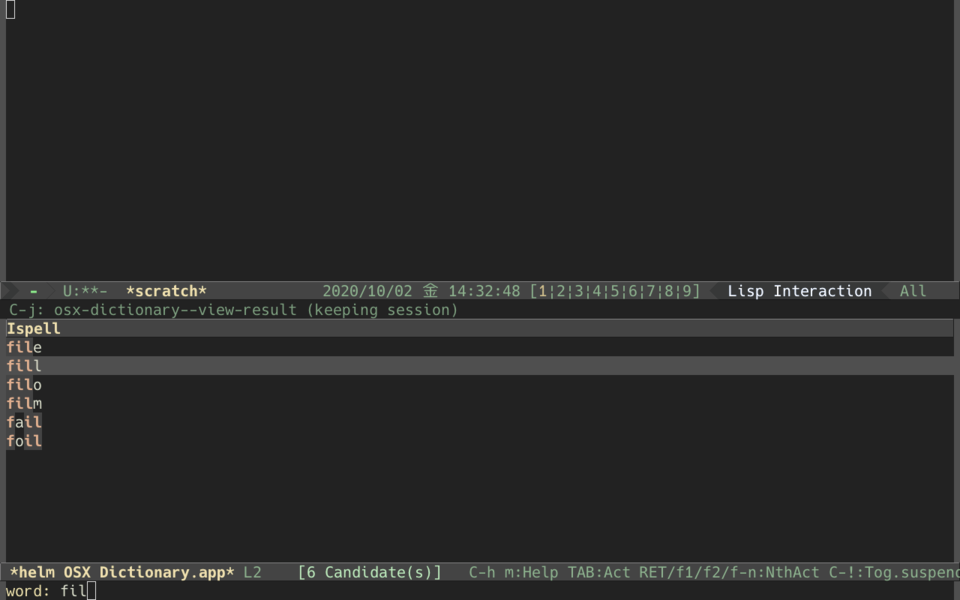

# helm-osx-dictionary

[helm](https://github.com/emacs-helm/helm) for looking up a word using 
[osx-dictionary.el](https://github.com/xuchunyang/osx-dictionary.el).

In action looking up words in `OSX Dictionary.app` with `osx-dictionary.el`

Completed words, which `ispell` command suggests or corrects, are passed to helm as candidates.

## Features

### `M-x helm-osx-dictionary-look-up-word`
Looking up a word. You can bind the function to a key.

### `M-x helm-osx-dictionary-mode`
`helm-osx-dictionary-mode` is a minor mode.
In the mode, `C-c C-l l` is bound to `helm-osx-dictionary-look-up-word`.

## Config

### helm-osx-dictionary-prefix-key
The prefix key in `helm-osx-dictionary-mode`. Default is `C-c C-l`.

### helm-osx-dictionary-requires 
Minimum length of input for starting completion. Default is `3`.
